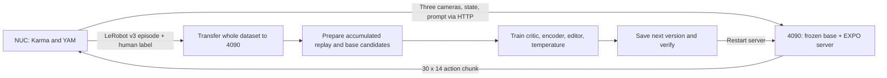

# Cloth folding with EXPO on a single RTX 4090 and bimanual YAM

This document describes the **working `stable-v2` cloth-folding experiment**:
one operator-labelled Karma rollout, an off-policy training round on the RTX
4090, a versioned checkpoint, and another rollout on the YAM NUC.

**Task prompt:** `fold the towel`

**Current documented checkpoint:** version **4**

**Current edit scale:** **0.05**

**Base π₀.₅ model:** **frozen**

**Status:** the operator reported better hardware behavior with version 3 and
very good results with version 4. This is qualitative experimental evidence;
there is no controlled success-rate benchmark yet.

The complete deployed policy improves through its learned critic, visual
encoder, action editor, and candidate selection. **The current experiment does
not change the base model's weights.** Keep that distinction when describing
the results as EXPO fine-tuning.

## Contents

- [Machines and artifacts](#machines-and-artifacts)
- [Run the next collection and training round](#run-the-next-collection-and-training-round)
- [What is trained](#what-is-trained)
- [Exact active configuration](#exact-active-configuration)
- [Data, rewards, and replay](#data-rewards-and-replay)
- [Training and action selection](#training-and-action-selection)
- [Scripts and implementation map](#scripts-and-implementation-map)
- [Recorded experiment history](#recorded-experiment-history)
- [Environment and installation](#environment-and-installation)
- [Karma references and other workflows](#karma-references-and-other-workflows)
- [Known limitations and troubleshooting](#known-limitations-and-troubleshooting)

## Machines and artifacts

| Component | Address or path | Role |
|---|---|---|
| GPU host | `sra@192.168.0.167` | RTX 4090, inference, candidate generation, RL training |
| Robot NUC | `yambox@192.168.0.178` | Karma, cameras, bimanual YAM control, LeRobot recording |
| GPU repository | `/home/sra/tirth/expo-ft` | This codebase |
| NUC repository | `~/karma` | [SRA-VJTI/karma](https://github.com/SRA-VJTI/karma) |
| Persistent GPU Python | `/usr/local/models/sra-expo-ft/venv-jax/bin/python` | Existing working Python environment |
| Base checkpoint | `/usr/local/models/sra-expo-ft/yam_pi05_jax` | Original working bimanual YAM π₀.₅ weights and processing assets |
| Tokenizer | `/home/sra/molmoact2/outputs/models/paligemma-tokenizer` | Tokenizer used by the base |
| Active experiment root | `/usr/local/models/sra-expo-ft/towel-expo-stable-v2/http-test-40b9aced` | Authoritative version pointer, sessions, replay, and continued training |
| Version 4 | `<active root>/versions/0004` | Learned EXPO weights and optimizer state |
| Compilation cache | `/usr/local/models/sra-expo-ft/jax-cache` | Persistent JAX compilation cache |
| HTTP endpoint | `http://192.168.0.167:8204` | NUC-to-GPU connection |

The `http-test-40b9aced` directory name is historical: it began as an isolated
server test and then became the experiment used for real collection and
continued training. **Use the entire active root above.** Its parent
`towel-expo-stable-v2` contains the initial offline experiment and is not the
current version registry.

Keep the base, tokenizer, replay, candidate caches, and version directories
available at their recorded paths. An EXPO `expo.msgpack` file is not a standalone
π₀.₅ checkpoint: serving also needs the frozen base and processing assets.



This is a **sequential single-GPU loop**. Stop serving before preparing or
training. The NUC controls the robot; the GPU-side training scripts do not open
robot drivers or connect to the NUC.

## Run the next collection and training round

The examples below collect **`round-0004` using version 4**, then produce
**version 5**. Change the episode number for subsequent rounds. Never reuse an
existing output directory or manually change a recording's policy version.

### 1. Start the EXPO server on the 4090

```bash
cd /home/sra/tirth/expo-ft

CUDA_VISIBLE_DEVICES=0 \
JAX_COMPILATION_CACHE_DIR=/usr/local/models/sra-expo-ft/jax-cache \
/usr/local/models/sra-expo-ft/venv-jax/bin/python scripts/yam/round.py \
  --root /usr/local/models/sra-expo-ft/towel-expo-stable-v2/http-test-40b9aced \
  serve --host 0.0.0.0 --port 8204 \
  --allow-diagnostic-network
```

The server reads `current.json`; no model filename needs changing between
rounds. At the documented snapshot, wait for:

```text
Warmup passed. Serving version 4
```

The explicit network flag allows this experimental profile to bind beyond
localhost. It does not change weights or remove the diagnostic provenance label.
Only one process can bind port 8204.

On the NUC, check the server without starting robot control:

```bash
curl -fsS http://192.168.0.167:8204/healthz | python3 -m json.tool
```

Verify `policy_version`, `policy_checkpoint`, `policy_weights_sha256`,
`base_actor_mode: "frozen"`, `edit_scale: 0.05`, and
`mask_gripper_edits: true`. The `checkpoint` field names the base; the separate
`policy_checkpoint` field identifies the learned EXPO version.

### 2. Copy the recording wrapper to the NUC

Run on the **NUC**:

```bash
cd ~/karma
scp sra@192.168.0.167:/home/sra/tirth/expo-ft/scripts/yam/record_round.py ./record_round.py
```

Use the existing configured Karma installation. The wrapper itself needs only
Python's standard library; its child process uses Karma's `uv` environment.

### 3. Record one episode on the NUC

**This command starts robot control.** Replace all five hardware placeholders
with the CAN interfaces and camera serials from the working Karma setup. The
documentation intentionally does not invent serial numbers or left/right bus
assignments.

```bash
cd ~/karma

python3 ./record_round.py \
  --server http://192.168.0.167:8204 \
  --out "$HOME/yam-expo-data/round-0004" \
  --seconds 300 -- \
  --interface left=LEFT_CAN \
  --interface right=RIGHT_CAN \
  --camera-serial top=TOP_SERIAL \
  --camera-serial left_wrist=LEFT_WRIST_SERIAL \
  --camera-serial right_wrist=RIGHT_WRIST_SERIAL
```

When Karma asks for the task, enter exactly:

```text
fold the towel
```

The wrapper invokes `uv run karma rollout` with one episode, 30 Hz, speed 1,
chunk size 30, 10 denoising steps, and `--no-prefetch`. These settings are fixed
by the wrapper and must not be overridden in the arguments after `--`.

Karma asks its own success question. After Karma finishes, the wrapper asks:

```text
Task success reward [0/1]:
```

Enter `1` for actual task success and `0` otherwise. For reward 0, choose:

- `failure`: a genuine terminal failure, including the task deadline when it is
  part of the task definition; no future value is bootstrapped.
- `truncated`: an external interruption of an unfinished task whose continuation
  should still have value; the critic bootstraps from its final observation.

A successful task stopped early can remain `success`. The importer accepts
Karma's interrupted flag with an explicit success label. An interrupted
unsuccessful attempt must currently be labelled `truncated` to pass the importer.
Do not change labels merely to bypass validation.

Keep the same server process alive until the wrapper saves `expo_session.json`.
It checks experiment, policy version, and server-session identity before and
after collection. The nominal five-minute budget does not guarantee five minutes
of recorded 30 Hz samples: inference pauses, early stops, and operator review
affect elapsed time and frame count.

### 4. Transfer the entire dataset

Create a destination on the **4090**:

```bash
mkdir -p /usr/local/models/sra-expo-ft/incoming
```

Then run on the **NUC**:

```bash
rsync -av --progress "$HOME/yam-expo-data/round-0004" \
  sra@192.168.0.167:/usr/local/models/sra-expo-ft/incoming/
```

This produces `/usr/local/models/sra-expo-ft/incoming/round-0004` on the GPU host.
Transfer parquet, videos, metadata, the Karma rollout manifest, and
`expo_session.json` together. `/usr/local/models` is preferred for new data
because the GPU host's `/home` partition has had very little free space.

### 5. Stop serving and prepare replay

After collection and labelling finish, stop the GPU server with **Ctrl+C**.
Use `nvidia-smi` to check for other compute jobs; earlier expert-training tests
ran out of memory when an unrelated process occupied about 5.6 GiB.

Run on the **4090**:

```bash
cd /home/sra/tirth/expo-ft

CUDA_VISIBLE_DEVICES=0 \
JAX_COMPILATION_CACHE_DIR=/usr/local/models/sra-expo-ft/jax-cache \
/usr/local/models/sra-expo-ft/venv-jax/bin/python scripts/yam/continue_stable.py \
  prepare \
  --root /usr/local/models/sra-expo-ft/towel-expo-stable-v2/http-test-40b9aced \
  --dataset /usr/local/models/sra-expo-ft/incoming/round-0004
```

`prepare` validates the collecting server's identity and weight hash, imports the
new episode, preserves prior replay, and generates fresh candidate pools for
**every replay episode**. It does not perform gradient updates. Progress is
reported as an episode index and observation `anchor`, not training steps.

Wait for:

```text
REPLAY AND FRESH CANDIDATE POOLS READY
```

With four episodes, the observed preparation time was approximately **1,062
seconds (17.7 minutes)** for 358 observation anchors. Sixteen candidates are
generated sequentially at each anchor. This cost grows with accumulated data.
Cache generation records per-anchor progress, so retrying the same pending
preparation can resume completed work.

### 6. Train the next EXPO version

```bash
CUDA_VISIBLE_DEVICES=0 \
JAX_COMPILATION_CACHE_DIR=/usr/local/models/sra-expo-ft/jax-cache \
/usr/local/models/sra-expo-ft/venv-jax/bin/python scripts/yam/continue_stable.py \
  train \
  --root /usr/local/models/sra-expo-ft/towel-expo-stable-v2/http-test-40b9aced
```

The trainer restores the current critic, encoder, editor, temperature, target Q,
optimizer moments, and learner RNG. It samples all registered replay episodes,
performs the conservative updates, checks checkpoint reload, and atomically
advances `current.json` only after successful completion.

For a new episode with more than 40 chunk transitions, this adds **40 critic
updates and two editor/temperature updates**. The base remains frozen.

Wait for `ROUND COMPLETE` and verify the reported next version. Do not use the
old `round.py train --updates 100 --actor-every 10` command: that historical
trainer has a different schedule. `stable-v2` explicitly rejects its ingest and
train paths.

### 7. Run the offline HTTP smoke test

For the example next checkpoint, version 5:

```bash
CUDA_VISIBLE_DEVICES=0 \
/usr/local/models/sra-expo-ft/venv-jax/bin/python scripts/yam/smoke_candidate_server.py \
  --root /usr/local/models/sra-expo-ft/towel-expo-stable-v2/http-test-40b9aced \
  --candidate /usr/local/models/sra-expo-ft/towel-expo-stable-v2/http-test-40b9aced/versions/0005 \
  --dataset /usr/local/models/sra-expo-ft/incoming/round-0004
```

This starts an isolated localhost server, replays 12 actual recorded
observations using both RGB and JPEG requests, checks the checkpoint hash,
response shape, finite outputs, sampled residual bounds, zero gripper residuals,
and invalid-input handling, then stops the server. It writes a `report.json`
under a new `http-test-*` directory. Check `passed: true`.

It does **not** command a robot, evaluate folding success, or certify physical
joint limits. A serving pass and a lower critic loss are not task-success tests.

### 8. Restart and collect the next episode

Run the same server command from step 1. It will now load version 5. Verify the
warmup message and health response, then use a new NUC directory such as
`round-0005` for the next collection.

## What is trained

| Component | Current behavior | Where implemented |
|---|---|---|
| Base π₀.₅ VLM and action expert | Frozen; proposes plausible action chunks | [base.py](../expo_ft/yam/base.py), [yam_loader.py](../expo_ft/conversion/yam_loader.py) |
| Critic visual encoder | Learned from replay; shared with the editor | [learner.py](../expo_ft/yam/learner.py), [stable.py](../expo_ft/yam/stable.py) |
| Ten online Q networks | Learned to predict discounted task return for a whole chunk | [stable.py](../expo_ft/yam/stable.py) |
| Ten target Q networks | Soft copies of the online Q parameters; no direct optimizer | [stable.py](../expo_ft/yam/stable.py) |
| Edit policy | Learned bounded stochastic corrections to joint targets | [learner.py](../expo_ft/yam/learner.py), [stable.py](../expo_ft/yam/stable.py) |
| Entropy temperature | Learned positive scalar controlling exploration pressure | [stable.py](../expo_ft/yam/stable.py) |
| Human reward source | Operator terminal label; no reward-classifier training | [record_round.py](../scripts/yam/record_round.py) |

The base is the behavior prior. The critic ranks options, and the editor supplies
small alternatives. The critic does not directly write robot actions and does
not backpropagate into the frozen VLA.

The earlier prototype supported successful-episode flow-matching updates to
roughly 564 million action-expert/projection parameters. That path is **not
active** in the successful stable-v2 sequence. `actor_lr` remains in the saved
schema but is unused when `actor_mode="frozen"`.

## Exact active configuration

The authoritative configuration is the active root's `experiment.json`, matched
against each checkpoint manifest. Defaults in `Settings()` retain historical
values for backward compatibility; **reading the defaults alone will not tell
you what this experiment uses**. Do not edit an existing experiment's settings
in place: version validation expects exact agreement with its checkpoint.

### Model and observation contract

| Parameter | Active value | Meaning |
|---|---|---|
| Model type / precision | π₀.₅, FP32 | Existing validated base loading and sampling path |
| Robot state / action width | 14 | Left six joints + gripper, then right six joints + gripper |
| Base internal action width | 32 | Model padding; only the first 14 coordinates go to the robot |
| `horizon` | 30 | Number of actions per predicted chunk |
| Critic action width | 420 | Flattened `30 × 14`; padded model coordinates are excluded |
| Edited coordinates | 360 | `30 × 12` joints; gripper residuals at indices 6 and 13 are zero |
| Cameras | Top, left wrist, right wrist | HTTP roles `top_cam`, `left_cam`, `right_cam` |
| Input image size | 224 × 224 | Checkpoint preprocessing; critic stacks three views into nine channels |
| Prompt token limit | 200 | Base observation/tokenizer configuration |
| Denoising steps | 10 | Used for all base candidates |
| State/action normalization | Saved q01/q99 statistics | Shared by serving and replay import |
| Action semantics | Absolute joint targets in radians | Residual is added to an absolute target; output is not joint velocity |
| HTTP gripper adaptation | None | Working pass-through behavior |

### Critic, editor, and optimization

| Saved setting | Value | Effect |
|---|---:|---|
| `num_qs` | 10 | Q ensemble size |
| `num_min_qs` | 2 | Random target-network subsample; use its minimum |
| `candidates` / `edits` | 8 / 8 | Sixteen options for action selection |
| `edit_scale` | 0.05 | Per-coordinate bound in normalized action space |
| `mask_gripper_edits` | true | Editor cannot directly alter either gripper |
| `initial_editor_logstd` | −3 | Small initial noise; output means initialize at zero |
| `actor_mode` | frozen | No base-weight or base-optimizer updates |
| `lr` | 1e-4 | Critic and critic-encoder Adam learning rate |
| `editor_lr` | 3e-5 | Editor Adam learning rate |
| `temperature_lr` | 1e-5 | Temperature Adam learning rate |
| `init_temperature` | 0.01 | Initialization only; trained value is restored across rounds |
| `gradient_clip` | 1.0 | Separate global-norm clipping for encoder, critic, and editor; temperature is not clipped |
| `discount` | 0.99 | Discount per nominal recorded control tick |
| `tau` | 0.005 | Target Q soft-update coefficient |
| `scale_entropy_target` | true | Stable learner uses consistent entropy coordinates |
| Effective entropy target | −180 | `−360/2`, measured before multiplying by ε |
| `stages` / `filters` | (3,4,6,3) / 64 | ResNetV2 critic encoder configuration |
| `image_latent` / `state_latent` | 512 / 64 | Visual and proprioceptive embedding sizes |
| `hidden` | (256,256,256) | Critic/editor MLP widths; critic uses LayerNorm |
| `seed` | 42 | Base configuration seed; round-specific sampling seeds are derived separately |
| `actor_lr` | 1e-5, inactive | Historical optional base-training setting |

The critic encoder uses ResNetV2 basic residual blocks, GroupNorm, and a
Dense/LayerNorm image embedding. There is **no separate target image encoder**;
target Q evaluations use the current critic image encoder.

### Training-driver settings

These are implemented by `continue_stable.py` rather than independent CLI flags:

| Setting | Value |
|---|---|
| Microbatch | One transition |
| Effective critic/editor batch | Eight transitions, gradients averaged before one optimizer step |
| Additional terminal objective | Mean loss over all terminal replay windows, weighted 0.25 |
| Critic updates this round | `min(40, 20 × ceil(new_transition_count / 40))` |
| Editor / temperature frequency | Once every 20 cumulative critic updates |
| Ordinary replay sampling | Episode probability proportional to transition count, then uniform window |
| Base candidate pool | 16 per observation anchor, refreshed each round |
| Backup candidate subset | Eight distinct entries drawn from that pool |
| Image augmentation | Independent 95% crops per view and current/next observation, resized back to 224 |
| Base candidates and augmentation | Generated from unaugmented base observations; crops apply to learned critic/editor inputs |

For reproducibility, continuation uses NumPy seed `42 + parent_version + 1000`
for replay sampling, pool subsampling, and augmentation. Candidate generation
uses seed `100000 + parent_version * 10000 + episode_index * 1000 + anchor_index`.
The learner's JAX RNG is restored from `expo.msgpack` and advanced during updates;
it is not reset to 42 each round. Optimizer moments and update counters are also
restored. Learning rates are constant, with no schedule or weight decay. The
editor's predicted log standard deviation is clipped to `[-20, 2]` before
sampling; its initialization is `-3`.

Eight sequential Adam updates would not be equivalent to this accumulation.
Here the parameters stay fixed while eight microbatch gradients are collected;
one averaged gradient produces one optimizer step. This budget is an engineering
adaptation, **not the paper's UTD=20 recipe**.

## Data, rewards, and replay

### Required recording contents

Each input directory must contain one LeRobot v3 episode and its videos, plus:

- `meta/info.json`: frame rate, data/video layout, episode count.
- `meta/episodes/`: episode index, frame count, video shard offsets.
- `data/`: state, actual commanded action, frame index, nominal timestamp.
- Three camera videos: `observation.images.top`, `.left_wrist`, `.right_wrist`.
- `openpi_control_rollouts.json`: prompt, speed, chunk size, saved/aborted outcome.
- `expo_session.json`: experiment ID, policy version, server session, human
  reward, terminal type, data frame, prefetch flag, and server metadata.

The continuation runner verifies the collected policy's **actual weight hash**
against the current parent, checks saved server-session identity, rejects stale
or duplicate data, and retains prior replay with its original provenance. A
regular unwrapped Karma recording does not automatically satisfy this contract.

### Gripper conventions

Our working server passes state and actions through without a gripper inversion.
Karma's inspected YAM dataset writer stores the opposite gripper polarity from
its native wire values. The importer therefore converts recorded indices **6
and 13** back to wire coordinates before applying checkpoint normalization.

This is a **dataset-boundary conversion**, not a server flip. Comparisons with
saved server traces found exact recorded-command matches after this conversion.
The Meta Quest controller mapping is a separate concern. Verify the writer if
changing Karma versions; do not infer model polarity from the Quest controls.

### Chunk transitions

The current importer uses 30 recorded commands and an observation at `t+30`.
Starts advance by 30, with an additional final full window when needed. The last
window may overlap its predecessor; fewer than 31 recorded frames are rejected.
No missing commands are invented to fill a partial chunk.

For terminal success, the final chunk reward is:

```text
R = gamma^29 × 1 = 0.747172...   when gamma = 0.99
```

Earlier chunk rewards and failure rewards are zero. For a transition with
bootstrap mask `m`, the critic target is:

```text
y = R + gamma^30 × m × min(Q_target_i(next_obs, next_action),
                          Q_target_j(next_obs, next_action))
```

`m=0` at true success/failure terminals and `m=1` for nonterminal transitions or
truncations. There is no entropy term in this Bellman backup. A successful
episode does **not** give reward 1 to every frame, and a failure is not assigned
reward −1.

The terminal auxiliary objective fits these observed terminal targets directly.
It averages over all terminal windows, not over success/failure classes. With
three successes and one failure its mean target is `3 × 0.747172 / 4 = 0.560379`,
which explains `terminal_target` in the version-4 logs.

## Training and action selection

### Inference

1. Preprocess three images, the 14-coordinate state, and the task prompt.
2. Draw eight fresh base-model noise samples and generate eight 30-step chunks.
3. Apply one stochastic edit to each chunk, producing eight edited alternatives.
4. Evaluate all sixteen candidates using the target Q ensemble.
5. Randomly choose two of the ten target critics; score each candidate by their
   minimum prediction, then execute the highest-scoring candidate.
6. Unnormalize the chosen chunk and return a `30 × 14` `json_numpy` response.

Base sampling is sequential to fit the GPU. Serving generates fresh candidates;
the finite pools are a **training-only** approximation.

For each active joint coordinate:

```text
u = mean + exp(log_std) × Gaussian_noise
edited_action = base_action + 0.05 × tanh(u)
```

With quantile normalization, the physical residual bound for coordinate `i` is
`0.025 × (q99_i − q01_i)`. It is not universally 0.05 radians. The bound applies
per coordinate per timestep, not to the whole chunk's norm or to changes between
two independently selected base candidates. Gripper masking prevents residual
edits, but Q ranking can still select a base candidate with different gripper
targets.

### Critic and editor updates

The critic loss is mean squared error across all ten online critics and the
effective batch, plus the weighted terminal loss. The encoder receives critic
gradients. Target Q parameters follow:

```text
target_Q = 0.995 × old_target_Q + 0.005 × updated_online_Q
```

Every twentieth critic update, the editor receives an accumulated batch. It
edits replay actions during training and minimizes:

```text
editor_loss = mean(alpha × log_probability(edit) − mean_over_10_online_Q(edited_action))
```

The critic and encoder are not updated by this editor loss. Gradients flow
through the fixed critic's action input into the editor. Training uses the mean
of all ten online Q predictions here; rollout selection uses min-of-two target
predictions. The selection and Bellman-backup critic pairs are sampled separately.

Temperature adapts exploration pressure using the **unscaled** tanh-edit
entropy. Masked gripper dimensions are excluded. For the 360 active coordinates,
the target is −180. Differential entropy can be negative; negative entropy is
not by itself an error.

This fixes the earlier mismatch between a scaled edit density and an unscaled
target. The original ε=0.2, 420-dimensional support could not reach the old −210
target. Simply reducing ε without correcting entropy units would not fix it.

### Logs and what they do not prove

| Metric | Interpretation |
|---|---|
| `critic_loss` | Bellman regression error on sampled replay |
| `terminal_loss` | Separate terminal regression error before its 0.25 weighting |
| `q_mean`, `target_mean` | Sampled values; not calibrated success probabilities |
| `critic_grad_norm` | Norm before optimizer clipping |
| `editor_updated` | True only on the scheduled editor steps |
| `edit_abs_mean` | Mean sampled normalized residual magnitude; not maximum motion |
| `entropy_unscaled`, `entropy_scaled` | Same distribution expressed in two coordinate systems |
| `temperature` | Learned α, restored across rounds |
| `transition_ids` | `[replay_episode_index, window_index]` for the effective batch |
| `terminal_aux_ids` | Terminal windows explicitly included this step |

Critic outputs are unconstrained and can remain negative even with nonnegative
rewards. Low loss means the current regression target was fitted; it does not
prove correct candidate ranking or improved folding.

## Scripts and implementation map

| File | Purpose |
|---|---|
| [record_round.py](../scripts/yam/record_round.py) | NUC wrapper: fixed collection settings, version/session checks, human label, `expo_session.json` |
| [continue_stable.py](../scripts/yam/continue_stable.py) | Current `prepare` and `train` workflow; accumulated replay, fresh pools, resumed optimizer state, atomic next version |
| [round.py](../scripts/yam/round.py) | Current serving and status CLI; also contains historical init/legacy training commands |
| [smoke_candidate_server.py](../scripts/yam/smoke_candidate_server.py) | Temporary localhost server and actual recorded-observation HTTP tests |
| [serve_jax.py](../scripts/yam/serve_jax.py) | Base-only server and shared Karma HTTP application |
| [stability_experiment.py](../scripts/yam/stability_experiment.py) | Initial stable-v2 bootstrap, explicit prior import, old/new ablations and offline diagnostics; not the normal continuation command |
| [smoke_expo.py](../scripts/yam/smoke_expo.py) | Historical synthetic memory/update test; not rollout training |
| [stable.py](../expo_ft/yam/stable.py) | Accumulated gradients, delayed editor updates, masked entropy, auxiliary terminal loss, crops |
| [learner.py](../expo_ft/yam/learner.py) | Settings, networks, candidate selection, shared state construction; legacy combined update also lives here |
| [base.py](../expo_ft/yam/base.py) | Base candidate generation and optional historical expert-only training |
| [replay.py](../expo_ft/yam/replay.py) | LeRobot import, gripper frame conversion, normalized chunks and terminal masks |
| [runtime.py](../expo_ft/yam/runtime.py) | Loads current version, exposes identity/configuration, logs inference traces |
| [rounds.py](../expo_ft/yam/rounds.py) | File hashes, exclusive lock, atomic JSON and version publication |
| [yam_loader.py](../expo_ft/conversion/yam_loader.py) | Base preprocessing, normalization, tokenization and OpenPI inference |
| [upstream EXPO learner](../expo_ft/agents/alg/expo_ft.py) | Reference algorithm implementation used when designing the adaptation |

Inspect the active state without loading the model:

```bash
cd /home/sra/tirth/expo-ft
/usr/local/models/sra-expo-ft/venv-jax/bin/python scripts/yam/round.py \
  --root /usr/local/models/sra-expo-ft/towel-expo-stable-v2/http-test-40b9aced \
  status
```

Each version contains `expo.msgpack`, `metrics.jsonl`, and `manifest.json`.
`expo.msgpack` includes learned weights, target Q, Adam state, RNG, and counters.
The manifest records parent identity, source hashes, settings, replay inventory,
terminal checks, and update counts. `sessions/` stores request traces containing
observations, candidates, all ten Q predictions, the chosen pair, and outputs.

The success episode from the original experiment is explicitly retained as
prior replay. Consequently, `current.json`'s consumed-episode list alone does
not enumerate all training data: consult `manifest.json.replay_inventory`.

## Recorded experiment history

The table refers to the **stable-v2 sequence**, not the earlier unstable
`towel-expo/versions/0001` prototype. Both directories contain a version named
`0001`; the full path matters.

| Recorded episode | Collecting policy | Human reward | Frames | Chunk transitions | Resulting stable version |
|---|---|---:|---:|---:|---:|
| `round-0000` | Original base, version 0 | 1 | 1,391 | 47 | 1 |
| `round-0001` | Stable version 1 | 0 | 3,363 | 113 | 2 |
| `round-0002` | Stable version 2 | 1 | 2,291 | 77 | 3 |
| `round-0003` | Stable version 3 | 1 | 3,364 | 113 | 4 |

Version 4 uses **350 replay transitions** from these four episodes and totals
**160 critic updates, eight editor updates, eight temperature updates, and zero
base updates**. Its reported very good hardware behavior occurred after this
training; that evaluation is not an additional replay episode until it is
recorded and imported with its own label.

The initial aggressive prototype used ε=0.2, batch 1, an editor update on every
critic step, and immediate base-expert updates. It performed poorly on hardware.
The stable restart changed all of those conditions, so improvements cannot be
attributed solely to ε.

Offline ablations found the old full policy's 95th-percentile adjacent-action
change was about **0.308 normalized units**, versus **0.0220** for the base. The
initial stable candidate measured **0.0221** on the same comparison observations.
This is an output-smoothness diagnostic, not a physical success metric.

Version 2 passed 12 recorded-observation HTTP tests with median inference time
about **1.51 seconds** and maximum sampled residual **0.0106**. The separate
version-4 HTTP test has not been documented as completed. Later versions must
not inherit an earlier version's test result automatically.

Further evidence: [stability results](./yam_expo_stability_results.md),
[round 2 results](./yam_expo_round2_results.md), and
[stability plan](./yam_expo_stability_plan.md).

## Environment and installation

Use the existing persistent environment; do not recreate or replace it during
an experiment. The old `.venv-convert/bin/python` command is not the working
path for this machine.

Recorded package versions:

| Package | Version |
|---|---|
| Python | 3.11.15 on the GPU host |
| JAX / jaxlib | 0.5.3 / 0.5.3, CUDA 12 build |
| Flax | 0.10.2 |
| Optax | 0.2.8 |
| Orbax checkpoint | 0.11.13 |
| NumPy | 1.26.4 |
| PyTorch | 2.7.1+cpu, used for preprocessing |
| PyArrow / PyAV | 25.0.1 / 18.1.0 |

Requirements sources:
[base/loading](../scripts/yam/requirements-convert.txt),
[HTTP serving](../scripts/yam/requirements-serve.txt), and
[EXPO extras](../scripts/yam/requirements-expo.txt).
These files are not a complete frozen environment lock; some dependencies use
ranges. Do not upgrade the running experiment merely to match a newer release.

If only EXPO extras are missing from the already working server environment:

```bash
cd /home/sra/tirth/expo-ft
UV_CACHE_DIR=/tmp/uv-yam-expo-cache /home/sra/.local/bin/uv pip install \
  --python /usr/local/models/sra-expo-ft/venv-jax/bin/python \
  -r scripts/yam/requirements-expo.txt
```

The scripts disable JAX preallocation, use the platform allocator, and set four
OpenMP threads by default. All model serving here is FP32; no BF16 change was
introduced to make the stable run fit. Candidate sampling dominates preparation
time; RL training itself took roughly 25–48 seconds in the documented small
rounds. The server needs about 1.5 seconds for a full eight-candidate request on
this setup, so 30 Hz command playback is **not 30 Hz replanning**.

For a new NUC installation, follow Karma's
[installation and setup](https://github.com/SRA-VJTI/karma#install-once) and
[YAM setup guide](https://github.com/SRA-VJTI/karma/blob/master/docs/yam-setup.md).
Its environment is separate from the GPU environment. Existing CAN mappings,
camera assignments, motor zeros, and calibration must remain those of the
working robot setup.

## Karma references and other workflows

Relevant upstream documentation:

- [Repository](https://github.com/SRA-VJTI/karma)
- [Inference and HTTP contract](https://github.com/SRA-VJTI/karma/blob/master/docs/inference.md)
- [Camera configuration](https://github.com/SRA-VJTI/karma/blob/master/docs/cameras.md)
- [LeRobot recording](https://github.com/SRA-VJTI/karma/blob/master/docs/recording.md)
- [HITL / DAgger](https://github.com/SRA-VJTI/karma/blob/master/docs/dagger.md)
- [CLI reference](https://github.com/SRA-VJTI/karma/blob/master/docs/cli.md)
- [Model servers](https://github.com/SRA-VJTI/karma/blob/master/docs/model-servers.md)

The code audit used Karma commit
[`b4f06f6d645755e605b6c0aec7c10af3d2c911d6`](https://github.com/SRA-VJTI/karma/tree/b4f06f6d645755e605b6c0aec7c10af3d2c911d6).
Generic upstream server-adapter advice does not override the verified
pass-through behavior of our local YAM server.

### Base-only comparison

Stop any server on port 8204. On the GPU host:

```bash
cd /home/sra/tirth/expo-ft
CUDA_VISIBLE_DEVICES=0 \
JAX_COMPILATION_CACHE_DIR=/usr/local/models/sra-expo-ft/jax-cache \
/usr/local/models/sra-expo-ft/venv-jax/bin/python scripts/yam/serve_jax.py \
  --checkpoint /usr/local/models/sra-expo-ft/yam_pi05_jax \
  --tokenizer /home/sra/molmoact2/outputs/models/paligemma-tokenizer \
  --host 0.0.0.0 --port 8204
```

This loads the original base without EXPO ranking or editing. It does not expose
the round identity required by `record_round.py`. For a normal, unrecorded Karma
inference run, use the existing hardware settings on the NUC:

```bash
cd ~/karma
uv run karma inference --rig yam_bimanual \
  --interface left=LEFT_CAN --interface right=RIGHT_CAN \
  --camera-serial top=TOP_SERIAL \
  --camera-serial left_wrist=LEFT_WRIST_SERIAL \
  --camera-serial right_wrist=RIGHT_WRIST_SERIAL \
  --server http://192.168.0.167:8204 \
  --norm-tag yam_dual_molmoact2 \
  --instruction 'fold the towel' \
  --speed 1 --chunk-size 30 --num-steps 10 --no-prefetch
```

This command moves hardware. It is useful for a base comparison but does not
produce a versioned EXPO training episode. Keep prompt, scene setup, control
settings and execution timing comparable when evaluating policies.

### HITL and demonstrations

Karma exposes `uv run karma teleop --record` for demonstrations and
`uv run karma hitl` for intervention-labelled episodes. See the linked guides
and `uv run karma hitl --help` for their complete hardware arguments.

**Our current wrapper calls `karma rollout`, not `karma hitl`.** The stable
importer does not implement intervention-aware segmentation or an intervention
loss. Do not substitute a HITL recording into this loop and assume its labels
are consumed correctly; that requires an explicit extension to collection and
replay. This experiment uses human terminal reward labelling, not online VR
intervention training.

## Known limitations and troubleshooting

### Recorder freshness and the missing first action

In the inspected Karma implementation, the recorder snapshots arm state before
a blocking policy request, then checks the age of that snapshot afterward. The
policy source can advance past action 0 while the recorder rejects the tick as
stale. Saved traces showed many requests with recorded action indices 1–29 only.

A prepared [Karma patch](../scripts/yam/karma-refresh-state.patch) opts the standard
rollout path into a fresh state read after polling, while retaining the genuine
stale-telemetry check. It passed 60 recorder tests using fake backends. Applying
it to the NUC has **not been verified** in this experiment; subsequent recordings
still showed the omission pattern.

To inspect/apply the prepared change on a matching NUC checkout, with the client
stopped:

```bash
cd ~/karma
scp sra@192.168.0.167:/home/sra/tirth/expo-ft/scripts/yam/karma-refresh-state.patch ./karma-refresh-state.patch
git apply --check ./karma-refresh-state.patch
# Only after the check succeeds and the diff matches your checkout:
git apply ./karma-refresh-state.patch
```

The patch changes first-action behavior; it does not repair old recordings or
add complete execution tracing. Do not repeatedly apply it if already installed.
The current replay remains based on fixed 30-command windows and nominal
timestamps, not authoritative request/execution alignment.

### Other operational points

| Symptom or question | What to check |
|---|---|
| `prepare` takes many minutes | It refreshes 16 candidates at every anchor of every retained episode; the frozen base is still expensive to sample |
| Cannot acquire experiment lock | Stop that experiment's server or other preparation/training process first |
| GPU out of memory | Check `nvidia-smi` for competing jobs; do not run base serving and preparation together |
| Stale version / hash mismatch | Verify that the dataset came from the current serving checkpoint; do not edit its session metadata |
| One episode already pending | Finish preparation/training for that episode before importing another |
| Failed training | No new version is committed; retry from the existing parent. Preserve the unpublished `.training-*` directory for diagnosis |
| Wrong model apparently loaded | Check full experiment root, `policy_version`, and `policy_weights_sha256`; the base checkpoint field alone is insufficient |
| Need to continue training | Use `continue_stable.py`; the original legacy training commands are blocked for this profile |
| Want to tune a parameter | Create a deliberately versioned experiment/configuration change; editing one JSON silently breaks checkpoint agreement |

The finite candidate pool, small replay, no held-out evaluation, long inference
pauses, and recording alignment remain material limits. Gamma .99 per 30 Hz tick
also discounts success roughly 46 seconds away to about 8.6e-7; it is the current
setting, not a demonstrated optimum for this long-horizon task.

### Relation to the papers

[EXPO-FT](https://arxiv.org/html/2605.25477) supplies the base-proposal, bounded
edit, Q-ranking and off-policy learning framework. Our implementation uses the
repository's network modules but modifies batching, scheduling, entropy handling,
terminal coverage and base training for this single-GPU experiment.

[Real-Time EXPO-FT](https://arxiv.org/html/2609.18207v1) addresses delayed
observations and reactive execution. This setup does not implement its complete
delay-conditioned/prefix-conditioned real-time loop or noise-Q backup filter.
Do not describe these results as an exact paper reproduction or compare a few
operator-labelled episodes directly with the paper's evaluation statistics.

To measure the improvement reported here, retain episode-level results, fixed
task definitions, comparable randomized initial conditions, and repeated base
versus learned-policy trials. The saved version manifests and request traces
provide the provenance needed for that evaluation.
