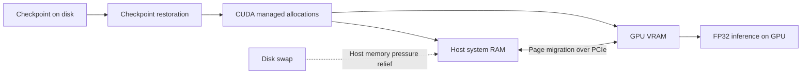

# YAM JAX serving: FP32, BF16, and limited VRAM

The same server supports RTX 3060, RTX 4090, and A100 CUDA GPUs. Select precision
with `--dtype fp32` or `--dtype bf16`, and select allocation behavior with
`--memory-mode device` or `--memory-mode unified`. The long precision spellings
`float32` and `bfloat16` also work. FP32 remains the default; precision never
changes automatically to make a model fit.

The commands below use the downloaded `yam-pi05/` bundle and `.venv-yam` from
the directory where they were installed. In a source checkout, the equivalent
entry point is `scripts/yam/serve_jax.py`; its flags are identical. Install the
bundle's requirements and pinned OpenPI checkout as described in its README.
Select one command, one GPU, and one server process. Do not start multiple copies
on the same GPU or port.

## Choose a mode

| GPU | Precision flag | Memory flag | Validation status |
| --- | --- | --- | --- |
| RTX 3060, 12 GiB | `--dtype bf16` | `--memory-mode device` | Warmup and 13 synthetic HTTP requests passed |
| RTX 3060, 12 GiB | `--dtype fp32` | `--memory-mode unified --memory-fraction 1.5` | Warmup and 13 synthetic HTTP requests passed |
| RTX 4090, 24 GB | `--dtype bf16` | `--memory-mode device` | Supported configuration; BF16 hardware validation pending |
| RTX 4090, 24 GB | `--dtype fp32` | `--memory-mode device` | FP32 server hardware-tested; updated CLI hardware retest pending |
| A100, 40/80 GB | `--dtype bf16` | `--memory-mode device` | Supported configuration; BF16 hardware validation pending |
| A100, 40/80 GB | `--dtype fp32` | `--memory-mode device` | FP32 server hardware-tested; tested capacity unspecified; updated CLI hardware retest pending |

The original FP32 server was hardware-tested on RTX 4090 and A100. The updated
device-mode FP32 command preserves its precision and allocator behavior. The
validation record consists of those hardware tests, the RTX 3060 measurements
below, and CPU-only regression tests for the updated CLI. BF16 validation on
RTX 4090 and A100 remains pending. The tested A100 memory capacity was not
recorded, so validation does not cover both capacity variants.

Available memory matters more than the card name. Other processes or an A100 MIG
partition can reduce it. Check `nvidia-smi` first. These settings assume the base
policy, batch size one, three cameras, a 30-action horizon, and 10 sampler steps.

### RTX 3060: BF16 in GPU memory

```bash
CUDA_VISIBLE_DEVICES=0 \
JAX_COMPILATION_CACHE_DIR="$PWD/jax-cache" \
.venv-yam/bin/python yam-pi05/scripts/yam/serve_jax.py \
  --checkpoint "$PWD/yam-pi05" \
  --tokenizer "$PWD/paligemma-tokenizer" \
  --dtype bf16 --memory-mode device \
  --host 0.0.0.0 --port 8204
```

### RTX 3060: FP32 using VRAM and system RAM

```bash
CUDA_VISIBLE_DEVICES=0 \
JAX_COMPILATION_CACHE_DIR="$PWD/jax-cache" \
.venv-yam/bin/python yam-pi05/scripts/yam/serve_jax.py \
  --checkpoint "$PWD/yam-pi05" \
  --tokenizer "$PWD/paligemma-tokenizer" \
  --dtype fp32 --memory-mode unified --memory-fraction 1.5 \
  --host 0.0.0.0 --port 8204
```

### RTX 4090 or A100: FP32 in GPU memory

Use this command on either GPU, with enough free VRAM and host RAM:

```bash
CUDA_VISIBLE_DEVICES=0 \
JAX_COMPILATION_CACHE_DIR="$PWD/jax-cache" \
.venv-yam/bin/python yam-pi05/scripts/yam/serve_jax.py \
  --checkpoint "$PWD/yam-pi05" \
  --tokenizer "$PWD/paligemma-tokenizer" \
  --dtype fp32 --memory-mode device \
  --host 0.0.0.0 --port 8204
```

### RTX 4090 or A100: BF16 in GPU memory

```bash
CUDA_VISIBLE_DEVICES=0 \
JAX_COMPILATION_CACHE_DIR="$PWD/jax-cache" \
.venv-yam/bin/python yam-pi05/scripts/yam/serve_jax.py \
  --checkpoint "$PWD/yam-pi05" \
  --tokenizer "$PWD/paligemma-tokenizer" \
  --dtype bf16 --memory-mode device \
  --host 0.0.0.0 --port 8204
```

Device mode uses the conservative `platform` allocator with preallocation off,
matching the tested BF16 setup. This allocates on demand and releases unused
allocations, but can be slower than a caching allocator. Larger GPUs do not
need unified memory when the complete working set fits in VRAM.

## How FP32 works on a 12 GiB GPU

The checkpoint metadata contains **3,353,433,872 parameters**. Uncompressed
FP32 weights require **12.49 GiB**; BF16 weights require **6.25 GiB**. Activations,
attention caches, temporary buffers, CUDA, and the display need additional
space. The compressed checkpoint's disk size does not represent its VRAM cost.

The RTX 3060 deployment encountered two distinct memory failures:

1. A bare `Killed` during restoration was a host out-of-memory kill, confirmed
   by the Linux kernel log. The machine had 16 GB RAM and nearly full 2 GiB swap.
   Adding 16 GiB swap helped checkpoint loading survive host memory pressure.
2. `RESOURCE_EXHAUSTED: Failed to allocate ... 1.96GiB ... device ordinal 0`
   was a GPU allocation failure. Additional disk swap alone could not solve it:
   the FP32 weights were already larger than the GPU's total VRAM.

Unified memory solved the second problem. CUDA manages allocations whose pages
can reside in either GPU VRAM or host system RAM. GPU access can trigger page
migration over PCIe. The model's matrix operations still run on the GPU; CPU
preprocessing and server work remain on the CPU. This is **memory offloading**,
not CPU execution of selected neural-network layers.



Swap is slower disk-backed storage used by the OS for eligible host pages; it is
not extra VRAM or a direct GPU execution tier. Unified-memory migration also
costs time, and performance depends on available RAM, the working set, and PCIe.
Do not assume that RAM, VRAM, and swap form one equally fast pool.

The new unified-mode flags set these environment values **before JAX is imported**:

```bash
TF_FORCE_UNIFIED_MEMORY=true
XLA_PYTHON_CLIENT_ALLOCATOR=default
XLA_PYTHON_CLIENT_PREALLOCATE=false
XLA_CLIENT_MEM_FRACTION=1.5
```

The allocator override is essential: the original server selected `platform`,
whereas the tested unified-memory path uses the default/BFC allocator.
`1.5` permits an allocator budget of approximately 1.5 times GPU memory, roughly
18 GiB for a 12 GiB card. It does not add physical VRAM, reserve 18 GiB of host RAM,
or promise that all workloads below that budget will fit. Preallocation is off,
so the allocator grows as needed. GPU-reserved memory and other allocations also
affect the available space.

Explicit `--memory-mode` overrides inherited settings. Without that flag, the
server recognizes `TF_FORCE_UNIFIED_MEMORY=true` (or `1`), preserving the original
environment-only launch command; otherwise it selects device mode. Unified mode
uses `--memory-fraction`, then the existing `XLA_CLIENT_MEM_FRACTION` or legacy
`XLA_PYTHON_CLIENT_MEM_FRACTION`, then 1.5. It normalizes the two variable names
to avoid JAX's conflicting-alias error. Device mode clears both fraction values
and disables unified memory. It rejects `--memory-fraction`, which is unused by
the platform allocator.

This differs from JAX's explicit `pinned_host` parameter-offloading APIs. The server does
not rewrite layers to fetch weights on demand or introduce CPU model execution.
The linked JAX host-offloading guide describes that separate approach.

## Precision is selected during restoration

`--dtype fp32` resolves to `float32`; `--dtype bf16` resolves to `bfloat16`.
The selected type is passed to both the model configuration and Orbax
`restore_params(..., dtype=...)`. Casting only after loading would still require
room for FP32 weights and could fail before BF16 inference started.

BF16 does not mean every operation and HTTP value becomes BF16. Normalization,
some numerically sensitive operations, and returned action arrays retain FP32.
Health and inference responses include a `dtype` field identifying the selected
model precision. `/healthz` also reports `memory_mode`, `memory_fraction`, and
`allocator`; startup logs show these settings. The wire normalization tag remains
`yam_dual_molmoact2` for both precisions because the action schema is unchanged.

## Host RAM and swap

The successful 3060 machine used 16 GB system RAM, its existing 2 GiB swap, and
an additional 16 GiB swap file. More physical RAM gives loading and offloading
more headroom. A larger GPU does not remove checkpoint restoration's host RAM
requirements.

Inspect the machine before creating anything:

```bash
free -h
swapon --show
df -h /
```

On the tested Linux/ext4 machine, these commands created a new file. Run only
if `/swapfile-yam` does not already exist and at least 16 GiB disk space is free:

```bash
if [ ! -e /swapfile-yam ]; then
  sudo install -m 600 /dev/null /swapfile-yam &&
  sudo fallocate -l 16G /swapfile-yam &&
  sudo mkswap /swapfile-yam &&
  sudo swapon /swapfile-yam
fi
```

This activation does not survive a reboot. If the existing file is no longer
listed by `swapon --show`, reactivate it with `sudo swapon /swapfile-yam`.
Do not recreate or truncate an active swap file. The benchmark setup did not modify persistent system swap configuration.

## Validation and measured results

Measured on 2026-10-04 with RTX 3060 12 GiB, compute capability 8.6, NVIDIA driver
580.178.04, JAX 0.5.3, and Orbax 0.11.13. These measurements used the same underlying
environment settings now exposed by the CLI. The refactored CLI is separately
covered by CPU-only regression tests. The benchmark predates the CLI refactor;
its results validate the underlying runtime configuration.

Both modes completed warmup and 13 HTTP requests. Inputs used synthetic RGB
images, zero joint state, and towel instructions. All responses had finite
`(30, 14)` actions. The medians below use the final 10 requests and exclude
initialization, compilation, and the first three requests.

| Measurement | BF16 device mode | FP32 unified mode |
| --- | --- | --- |
| Median server inference time per 30-action chunk | 360.70 ms | 890.36 ms |
| Observed total GPU memory usage | 6,724 MiB | 11,868 MiB |
| Weight storage requirement | 6.25 GiB | 12.49 GiB |
| Relative inference time | 1× | 2.47× |

FP32's first HTTP request took about 3.24 seconds inside the server. Memory
figures are snapshots from `nvidia-smi`, not measured peaks; they include other
GPU users. Later FP32 observations showed about 9 GiB total system RAM in use
and 3.5 GiB swap in use, including the OS and other processes. Synthetic-input
checks establish startup and finite outputs, not task success, FP32/BF16 parity,
or long-duration stability. The original FP32 server was hardware-tested on RTX 4090 and
A100. Comparable timing measurements for those GPUs are not included in this
benchmark record.

Raw request timings are in [the recorded results](yam_jax_serving_results.json).

## Start, inspect, and troubleshoot

Wait for `Warmup passed` and `Uvicorn running`, then check:

```bash
curl --fail http://127.0.0.1:8204/healthz
nvidia-smi
free -h
```

Restart an existing server to apply new flags or code. Stop it with Ctrl+C in
its terminal. Keep one worker; multiple workers duplicate model memory. A
compilation cache saves compilation work, not model VRAM.

For a bare `Killed`, inspect host OOM logs:

```bash
journalctl -k -b --no-pager | rg -i 'out of memory|killed process|oom'
```

For GPU `RESOURCE_EXHAUSTED`, check other GPU processes, precision, and memory
mode. FP32 device mode cannot fit the full weights on a 12 GiB 3060. Use BF16
device mode or the tested FP32 unified mode. Unified memory can still exhaust
RAM or its allocation budget; increasing the fraction blindly is not a fix.

## References used

- [DeepMind AlphaFold 3: Unified Memory](https://github.com/google-deepmind/alphafold3/blob/main/docs/performance.md#unified-memory): the source of the JAX/CUDA environment-variable recipe used for the RTX 3060 deployment. The deployment used a tested fraction of 1.5 rather than the reference example’s value.
- [JAX GPU memory allocation](https://docs.jax.dev/en/latest/gpu_memory_allocation.html): preallocation and the default/platform allocator behavior.
- [JAX memory spaces and host offloading](https://docs.jax.dev/en/latest/201/memory-spaces.html): explicit host placement, parameter offloading, and transfer costs; background on explicit offloading, which differs from this server’s unified-memory implementation.
- [NVIDIA Ampere tuning guide](https://docs.nvidia.com/cuda/ampere-tuning-guide/index.html): FP32, BF16, and TF32 hardware capabilities. TF32 is not a way to halve FP32 weight storage.
- [NVIDIA RTX 3060 specifications](https://www.nvidia.com/en-us/geforce/graphics-cards/30-series/rtx-3060-3060ti/) and [RTX 4090 specifications](https://www.nvidia.com/en-us/geforce/graphics-cards/40-series/rtx-4090/): GPU specifications; the actual 3060 was also queried through the CUDA driver.
