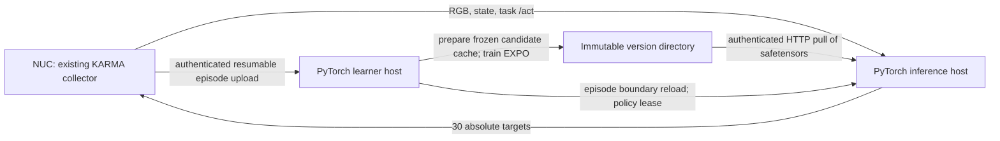

# Native PyTorch EXPO for fold-70

For the complete translation map, gradient explanation, tested standalone
4090/SCP commands, and verified version-1/version-2 results, see
[JAX-to-PyTorch implementation and operating record](yam_jax_to_pytorch.md).
The three-host commands below describe the separate online mode; the current
manual experiment uses 4090 inference at `192.168.0.130:8202`.

This branch adds a separate PyTorch implementation for
`/home/sra/ksagar/lerobot/yam_fold_70`. It does not convert this checkpoint into
pi0.5/JAX. The initial base remains frozen; the image encoder, Q ensemble,
edit policy and entropy temperature learn from versioned KARMA episodes.
The old JAX commands and checkpoints remain separate.

**The current 12 GB RTX 3060 cannot serve this export unchanged.** On the 4090,
the base-only path allocated 12.06 GiB; eight batched candidates allocated
12.86 GiB. The online inference launcher refuses GPUs below 14 GiB total memory rather
than advertising readiness and failing on the first action. That threshold
rejects the known insufficient configuration; it is not a guarantee that every
larger GPU will work. Run the offline benchmark and warmup on the intended GPU.
Initial implementation checks were offline. Subsequent operator-run robot
episodes and training through version 2 are recorded in the migration document.

## Contract and source references

- [The supplied README](/home/sra/ksagar/lerobot/yam_fold_70/README.md), sections
  “Precision and contents”, “Custom camera and state inputs”, and “Karma YAM
  gripper mapping and logs”, defines native mixed BF16/FP32 storage, three
  camera roles, absolute 30×14 joint targets, and identity live-wire grippers.
  The two gripper channels are 6 and 13, with 1=open. Do not call `.bfloat16()`
  on the loaded policy. The local README is authoritative for this export.
- [Pinned LeRobot code](https://github.com/hq-fang/lerobot/tree/5f8be1af5380d89ba4f645bc69a9c10c632a8025):
  `src/lerobot/policies/molmoact2/modeling_molmoact2.py:854` applies mixed dtypes;
  `:2108` implements continuous `predict_action_chunk`; and
  `processor_molmoact2.py:633` implements masked normalization. We load the
  saved mixture statistics and saved pre/postprocessors. Grippers bypass
  quantile normalization; replay cannot use the old all-channel JAX helper.
- The pinned base model revision is
  `allenai/MolmoAct2-BimanualYAM@8dcbed66f2380e4393189c303ea72488eb9e63c2`.
  Its `modeling_molmoact2.py:3178` accepts precomputed encoder KV states.
  `base.py` caches these only within a single observation and uses the same
  encoder attention mask as the uncached HF path. Sequential cached sampling
  was exactly equal to the public LeRobot sampler for the benchmark seed.
  Batched random sampling is distributionally equivalent, not promised to use
  the same random stream as eight sequential CUDA calls.
- The deployed KARMA `src/openpi_control/record.py:84–110` documents a different
  **recording** convention: dataset 0=open versus live native 1=open. Replay
  applies `dataset_to_wire` exactly once for `dataset_frame=karma-recorded`.
  It never inverts the live server input/output. This was inspected directly
  on yambox, not inferred from the model's statistics.
- [EXPO-FT §3, §4 and Appendix D](https://arxiv.org/html/2605.25477v2) motivates
  candidate selection, bounded residual editing and ensemble chunk-value
  learning. The local reference is `expo_ft/agents/alg/expo_ft.py`, especially
  `update_edit_actor`, `update_critic`, and the target update. The implemented
  objectives follow `expo_ft/yam/stable.py` and `learner.py`: Q10/min2,
  discounted 30-command targets, no entropy bonus in the TD target, detached
  encoder features for editor updates, and a Polyak target Q. There is no
  target visual encoder and no gradient through the VLA.
- [Real-Time EXPO-FT §IV](https://arxiv.org/html/2609.18207v1) describes a separate
  delayed-prefix control algorithm. This implementation retains the previous
  supervised, **no-prefetch episode loop**. It does not claim to reproduce
  RTC inpainting, noise-space filtering or the paper's full base-model update.

The default conservative profile follows `scripts/yam/stability_experiment.py:30`:
edit scale .05, critic LR 1e-4, editor LR 3e-5, temperature LR 1e-5, initial
alpha .01, gradient clip 1, and initial editor log standard deviation -3.
Gripper edits are masked. Effective batch size is 8, editor updates occur every
20 critic updates, and each round performs 40 critic updates. These are local
engineering settings, not a claim to match all paper hyperparameters.
The critic uses the repository's preactivation GroupNorm residual layout,
spatial flattening, and an image embedding of 512. PyTorch checkpoints are not
numerically interchangeable with JAX checkpoints. Normalized arm candidates
are clipped to the saved postprocessor's action range before ranking.

## Components and episode flow



1. `start_4090.sh` creates a new version-0 experiment from fold-70, fingerprints
   model/config/processors, creates a private token, and starts the existing
   resumable upload coordinator with the PyTorch training entry point.
2. The inference service fetches the experiment definition, verifies its local
   checkpoint bytes, loads once, and warms up. It serves the saved model at v0.
3. The NUC uses the existing `collect_online.py`, `record_round.py`, and
   `karma_episode.py`. The default is **five episodes, 300 seconds each**, with
   strict `ready` scene confirmation and a separate Enter confirmation before
   robot control. The task is pinned. Existing reward 0/1 and
   failure/truncated prompts remain intact.
4. Completed uploads are verified and admitted. The learner imports all prior
   verified replay, preserves raw images for the VLA, normalizes using fold-70,
   and caches eight next-action candidates per observation anchor. Old caches
   are reused only with their recorded hashes. VLM context is reused within an
   observation; the trainable critic's image embedding is not cached.
5. Prepare and train are separate subprocesses, releasing the large VLA before
   critic optimization. Training uses accumulated microbatches; optimizer and
   RNG state are saved for continuation. Completed versions are committed by
   atomic directory rename and registry replacement.
6. At the next episode boundary, the inference host pulls only
   `policy.safetensors`, checks SHA256, loads a new agent beside the old one,
   warms the selector and swaps it under the same mutex as inference. An active
   lease pins the version returned by the candidate store, including direct
   authenticated reload requests. Failed transfers/loads retain the live agent.
7. Coordinator jobs, per-step metrics, human outcome labels, versions and serving
   sessions are durable. On a worker crash the job is marked failed and new
   updates stop; there is no silent retry or automatic robot restart.

Ports are separate from the old JAX run: inference **18304**, upload/control
**18308**, checkpoint/status store **18309**. Bind to explicit wired IPs. No
Redis, gRPC service, full-model transfer per episode, or optimizer transfer is
required. Remote serving directories can differ from learner directories.

## Environment and launch commands

Use Python 3.12, the pinned LeRobot checkout, and its `[molmoact2]` extra. Do not
install this branch through the root `pyproject.toml`: that remains the JAX
installation definition. For a new GPU-host environment:

```bash
git clone https://github.com/hq-fang/lerobot.git /path/to/lerobot
cd /path/to/lerobot
git checkout 5f8be1af5380d89ba4f645bc69a9c10c632a8025
uv venv --python 3.12 .venv
uv pip install --python .venv/bin/python -e '.[molmoact2]'
uv pip install --python .venv/bin/python -r /path/to/expo-ft/scripts/yam/torch/requirements.txt
```

Local validation used `/home/sra/ksagar/lerobot/.venv/bin/python`, PyTorch
2.11.0+cu128, and the existing pinned checkout. Only missing transport/test/video
dependencies were added to that environment; its tracked LeRobot code and the
model files were not modified.

The following are **operator commands**, not an assertion that the current
3060 can run the model. Resolve the inference VRAM blocker before starting
KARMA. With adequate inference hardware, copy this repository's `pytorch`
working tree to both GPU hosts and the NUC, and copy the fold-70 model assets to
the inference host once. Keep old experiment roots separate.

Learner (4090):

```bash
cd /home/sra/tirth/expo-ft
export YAM_TORCH_ROOT="$HOME/yam-torch/fold70-test-001"
export YAM_TASK='fold the towel'
bash scripts/yam/torch/start_4090.sh
```

Copy **only the new run's** `control.token` to private files on inference and
NUC (`chmod 600`). Never reuse the old JAX token. Initializing and serving a
learner does not move the robot. The inference host must have the identical
checkpoint plus the pinned HF base cache (the loader can download it on first
use; that initial download is not an episode-time operation).

Inference (launcher is named for the original topology, but currently refuses
that 12 GB card):

```bash
cd /path/to/expo-ft
export YAM_TORCH_PYTHON=/path/to/lerobot/.venv/bin/python
export YAM_TORCH_CHECKPOINT=/path/to/yam_fold_70
export YAM_TORCH_SERVE_ROOT="$HOME/yam-torch/fold70-test-001-serve"
export YAM_CONTROL_TOKEN_FILE="$HOME/yam-torch/fold70-test-001.token"
bash scripts/yam/torch/start_3060.sh
```

`YAM_INFERENCE_IP`, `YAM_POLICY_URL`, `YAM_LEARNER_IP` and `YAM_STORE_URL`
override the original wired addresses when using different inference hardware.
Moving both roles onto one 4090 is **not** validated: independent prepare and
serving processes each load the full VLA and can exhaust VRAM.

NUC, only after the intended server is warmed and the operator is ready:

```bash
cd /path/to/expo-ft
export YAM_DATA_ROOT="$HOME/yam-expo-data/fold70-test-001"
export YAM_CONTROL_TOKEN_FILE="$HOME/yam-lan/fold70-test-001.token"
bash scripts/yam/torch/start_nuc.sh
```

The NUC script includes the established ASIC serials:
`top=348523020354`, `left_wrist=254623070863`,
`right_wrist=254623070417`, with `can_left` and `can_right`.
It does not guess camera roles from SDK serial enumeration.

To survive terminal closure, open an explicit tmux session on each host
(`tmux new -s yam-torch-learner`, `yam-torch-inference`, or `yam-torch-nuc`),
then run the corresponding command inside it. **Closing a tmux client detaches;
it does not stop robot motion.** Ctrl+C in the active collector requests the
existing KARMA cleanup and outcome-label path. Do not use `tmux kill-server`
as a robot stop method. Native hardware errors remain fail-closed; this code
does not bypass CAN/servo checks or auto-retry a robot episode.

Learner and inference console logs are appended under their own `logs/` roots.
Per-round `metrics.jsonl` and checkpoint manifests live under learner
`versions/`; subprocess logs remain in repository `logs/online-*-{prepare,train}`.
The NUC recorder preserves its native runtime logs with each episode.

Read-only monitoring, optionally every five minutes:

```bash
/path/to/lerobot/.venv/bin/python scripts/yam/torch/status.py \
  --token-file "$YAM_TORCH_ROOT/control.token" \
  --output "$YAM_TORCH_ROOT/monitoring" --interval 300
```

## Validation and limits

See [the measured report](benchmarks/yam-fold70-pytorch-4090.json). It uses one
recorded camera/state observation read from the previous experiment; it does
not relabel or admit that old JAX rollout into this new experiment.
The timing samples are smoke measurements, not p95 latency guarantees.

| Offline 4090 measurement | Result |
|---|---:|
| Model load | 101.5 s |
| Base-only one chunk, warm | 0.316 s |
| Eight sequential candidates, no prefix reuse | 2.438 s |
| Eight sequential candidates, shared prefix | 1.925 s |
| Eight batched candidates, shared prefix, warm | 0.316 s |
| Peak base candidate allocation | 12.86 GiB |
| Serving EXPO tensor payload | 170.19 MB |
| One critic update, effective batch 8 + terminal auxiliary batch | 0.337 s |
| One editor update, effective batch 8 | 0.051 s |
| EXPO training peak allocation, base released | 0.743 GiB |

170.19 MB takes a theoretical 1.36 s at 1 Gbit/s, or about 1.70 s at
100 MB/s effective throughput, excluding disk reads, hashing, HTTP and warmup.
These are calculations, not new LAN measurements. Full optimizer checkpoints
are larger and stay on the learner.

A nominal 9000-frame, 300-second episode produces 302 distinct
anchors with the current 30-command window importer. Extrapolating one warm
observation measurement gives roughly 95 seconds of candidate sampling, plus
about 102 seconds of model load and roughly 14 seconds of updates: around
211 seconds **before decoding, checksums, serialization and network sync**.
The cached RGB alone is about 626 MB for 302 three-camera 640×360 anchors.
Neither the five-minute end-to-end deadline nor the 3060 deployment is proven.
Production acceptance requires a complete real episode benchmark on the final
hardware, then operator-supervised evaluation.

The 11 native PyTorch tests passed. Tests cover two successive offline replay/update/publication rounds, masked
grippers and recording conversion, terminal/truncated backups, accumulated
gradients, RNG/optimizer resume, HTTP contract, failed candidate installation,
and preservation of the old live policy after a failed reload. They use small
networks for CPU coverage; the report separately exercises the real fold-70
model and production-size EXPO network on the 4090.

The prior JAX/collection regression suite passed on CPU (38 tests). An initial
CUDA run exposed the existing JAX sequential-versus-vmap gradient tolerance
failure (`test_parallel_accumulation_preserves_gradients_and_keys`); that
algorithm file was not changed. The same test passes on CPU. Do not interpret
the new PyTorch tests as proof of JAX GPU numerical parity or robot safety.

Full-base/LoRA updates, 3060 CPU offload or quantization, and true delayed-prefix
RTC are not implemented in this backend. A future base change needs a new
fingerprint, invalidation of frozen candidate caches, a new base optimizer and
full model/adapter publication. A 12 GB export transfer alone is approximately
96 seconds at theoretical gigabit speed, before disk/checksum/warmup overhead.
Those changes must be measured independently and must not silently reuse the
frozen-base assumptions or replace this model's saved normalization.

## Offline action-generation and Q-learning test

On the 4090, with the GPU available:

```bash
cd /home/sra/tirth/expo-ft
bash scripts/yam/torch/test_actions_q.sh
```

This defaults to the local fold-70 export and the labeled historical episode
from `lan-five-20261007-001`. It samples 16 transition windows including the final
window, generates eight candidates for each required observation, frees the
base model, and performs 40 critic updates plus the scheduled editor updates.
Use `--critic-only` to disable editor updates. The historical labels retain
their original behavior-policy identity; they are explicitly off-policy data.
No fake rewards or zero-action placeholders are used in the learner batch.

Results are in a new `artifacts/torch-actions-q-TIMESTAMP/` directory; console
output is also saved to the adjacent `.log` file. `base_actions.npz` contains
physical and normalized fold-70 proposals. `selected_actions.npz` contains the
selected action chunk and the Q ensemble's candidate scores. `q_before.json`,
`q_after.json`, `metrics.jsonl`, and `report.json` show the learning diagnostics.
The saved checkpoint is diagnostic only and is not published to an online run.

Override `YAM_TEST_DATASET`, `YAM_TEST_OUTPUT`, or `YAM_TORCH_CHECKPOINT` as
needed. The Python entry point also accepts repeated `--dataset` arguments for
multiple labeled single-episode recordings with the same task. One successful
episode is sufficient to exercise the code, but cannot demonstrate reliable
policy improvement or calibrated success probabilities. These are in-sample
Q-fitting diagnostics, not a held-out evaluation.

If the action/Q test reports a missing `transformers` package, repair the exact
Python environment selected by the launcher:

```bash
uv pip install --python /home/sra/ksagar/lerobot/.venv/bin/python \
  'transformers==5.5.4' 'peft>=0.18,<0.20' 'scipy>=1.14,<2'
```

The runner now imports the model dependencies before decoding recordings or
creating its output directory. A later `uv sync` in the LeRobot checkout can
remove optional extras when they are not selected; include `--extra molmoact2`
when syncing that environment. The failed run's artifacts are preserved, and
rerunning the shell command creates a fresh timestamped diagnostic directory.
