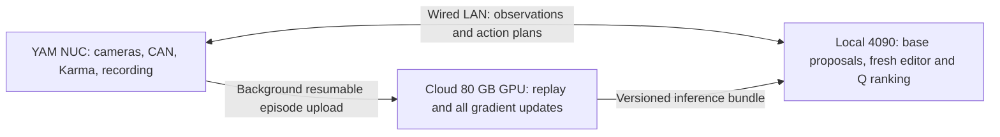

# YAM Real-Time EXPO-FT: implemented pieces and remaining work

Status, 2026-10-03: the frozen-base hardware experiment is concluded and its
learner is stopped. A separate [full-base deployment trial](yam_base_update_benchmark.md)
was verified serving on the pod on that date. Service availability must be checked
again before use. The implemented online workflow is **delayed online EXPO with a
frozen base**, automatic episode uploads and policy changes between episodes.
It supports collection/training overlap but does not promise action deadlines.
Use the [online runbook](yam_online_runbook.md) for commands and
[final results](yam_online_results.md) for measured outcomes.

## Paper recipe versus this deployment

[EXPO-FT v2](https://arxiv.org/html/2605.25477v2) combines chunk critics, bounded
edits, candidate ranking and supervised base-policy updates. Its appendix uses
LoRA initialization and freezes the base image encoder during RL. Its description
of VLA fine-tuning should not be read as a requirement to optimize every weight.

[Real-Time EXPO-FT v1](https://arxiv.org/html/2609.18207v1) separates delayed VLA
sampling from fresh-observation editing/ranking. It includes committed-prefix
conditioning, delay-aware backups and a noise-Q filter. Appendix VII-E starts
learning after ten completed episodes and flushes accumulated updates at episode
boundaries. Its reference uses 32 base candidates and 32 edits, batch size 64,
UTD 20, and success-only base updates with language LoRA plus other trainable
components. Updating during execution on a single GPU is an additional systems
extension, not the reported scheduling recipe.

Our run instead began learning after the first episode, used stable-v2's
conservative schedule, and kept the base frozen. Subsequently, separate offline
all-weight flow-matching runs and a 40-update episode-held-out fit were completed;
see [base training measurements](yam_base_update_benchmark.md). Those runs did
not implement online LoRA or prefix-conditioned base RL. Neither workflow is a
complete implementation of the paper recipe.

## Implementation map

| Component | Implemented | Remaining |
| --- | --- | --- |
| YAM preprocessing | 14-D joint/gripper frame, three cameras, saved normalization | Preserve parity in future optimized transport |
| Streaming transport | Binary MessagePack WebSocket over SSH, diagnostic journal, hardware bridge | Deadline-aware plans and direct binary-image encoding |
| Online collection | Ten-episode runner, operator prompts/labels, resumable background archive uploads | Per-tick execution/observation streaming |
| Replay and training | Episode queue, older-policy provenance checks, frozen-base caches, critic/editor/temperature updates | Fresh/delayed observation alignment, executed prefixes and filter critic |
| Publication | Completed checkpoint checks and one collector lease; changes between episodes | Crash recovery and richer behavior validation |
| Prefix sampler | `rtc_sampling.py`, exact prefix preservation and zero-delay parity checked | Meet end-to-end deadlines and integrate with the executor |
| Base adaptation | Separate offline all-weight fitting, best-checkpoint export and serving checks | Online success-only prefix loss, LoRA initialization and resumable optimizer integration |

`expo_ft/agents/alg/realtime_expo_ft.py` and `expo_ft/agents/vla/pi05.py` contain
upstream algorithm and prefix-training components. `train_pi_robo_async.py`
assumes a device split with inference and learning on different GPUs. The
upstream environment client is DROID-oriented, not a drop-in KARMA client.
Repository defaults also differ from the paper's reference settings; they must
be made explicit when adapting the learner.

## Latency budget

The tested checkpoint has horizon H=30. The current upstream slicing adapter
requires `delay <= C`, `2*C <= H`, and sufficient output positions for delay+C.
A five-tick delay allows 167 ms at 30 Hz; an eight-tick window allows 267 ms.
The shared-cache sampler took roughly 963–980 ms for 32 candidates before
network or Q/editor processing. The hardware network added seconds in the
recorded-observation smoke test. This configuration cannot satisfy the proposed
RTC timing budget.

Sequential chunk execution can still work with pauses, as the hardware run
demonstrated. Do not describe that as uninterrupted real-time execution. Larger
windows, slower control, fewer candidates or altered precision are adaptations
that need explicit validation, not silent substitutes for the reported recipe.

Priority measurements:

1. Reduce payload overhead and benchmark image resizing/encoding against the
   validated preprocessing. Current inference envelopes contain JSON/base64.
2. Optimize the shared-cache sampler and precompile fixed shapes. The validated
   base path is FP32; BF16 requires renewed numerical and behavior checks.
3. Measure NUC capture-to-execution latency under uploads and gradient load,
   including buffer underruns and request deadlines.
4. If network latency dominates, compare a nearer GPU or suitable local inference
   hardware. A different RPC framework alone does not remove WAN latency.

## Required RTC replay contract

Every observation/plan/execution record needs experiment and episode IDs,
sequence/tick IDs and policy hashes. Store both delayed base observations and
fresh editor observations, the committed action prefix, intended execution tick,
actual applied commands after limits/interventions, timestamps, terminal labels
and rewards. Finalize only executed action windows. Nominal LeRobot timestamps
and arbitrary fixed windows cannot reconstruct missing delay alignment.

Use NUC monotonic durations for end-to-end timing and server-local durations for
compute. Do not subtract unsynchronized wall clocks as though they were one-way
latency. Replace stale pending observations, but durably retain executed-action
records and labels. Reject expired, wrong-episode or wrong-version plans and use
KARMA's defined local stop behavior on underrun.

Human rewards arrive at episode end. Live uploads do not supply earlier rewards;
training during collection uses previously finalized episodes. Provisional
transitions would need an explicit correction strategy rather than fabricated
failure rewards.

## Single-GPU scheduling and model publication

The implemented experiment uses separate inference and learner processes with
JAX preallocation disabled. This enables overlap but gives no GPU priority or
latency guarantee. Candidate preparation loads a second frozen base and used
more memory than EXPO gradient updates. Measurements are in the results report.

A deadline-aware implementation should admit small training units according to
measured execution-buffer slack, keep disk/network work outside the GPU critical
path, and use immutable inference snapshots. Python threads, MPS or memory caps
alone do not establish kernel preemption or deadline guarantees. Base-gradient
steps may need episode-boundary scheduling even if small critic updates overlap.

## Transport alternatives

Persistent binary WebSocket is implemented and interoperates with the existing
SSH access. gRPC streaming is a reasonable alternative for typed service APIs,
but no comparative latency benchmark was performed. Direct authenticated WSS or
a private network could be compared with SSH. Separate upload and action
connections avoid one application queue, but tunnels on the same SSH connection
still share TCP congestion and recovery. QUIC/UDP would require additional
ordering, expiry and reliability design; it is not an established fix here.

## Agreed local/cloud architecture (planned, not implemented)

Decisions confirmed on 2026-10-03:

- The club RTX 4090 (24 GB) can remain available on the same wired LAN as the NUC.
- Use each paper's trainable-parameter recipe, rather than literal all-weight
  training as the main online algorithm.
- Continue collecting on the current local policy while cloud updates/downloads
  are pending. Activate the newest complete validated version between episodes.

Internet latency affects learning freshness instead of each hardware action.
This is an architectural recommendation, not a claim that full RTC already fits
or meets deadlines on the 4090. The A100's 13.31 GiB base-serving measurement is
not a measurement of 32-candidate inference plus the full editor/critic on a 4090.

### Alternatives and hardware evidence

| Arrangement | Benefit | Limitation / decision |
| --- | --- | --- |
| Local 4090 inference + cloud training | Independent compute and local action traffic | Recommended; measure model-transfer cost and 4090 capacity |
| One cloud A100 for inference and learning | No remote model publication needed | WAN jitter and GPU contention; retain for pause-tolerant tests |
| Everything on the 4090 | No WAN dependency | Benchmark paper-style training between episodes; 24 GB fit is unproven |
| Cloud base + local editor/Q | Fresh correction stays local | Late base proposals remain a deadline problem; experimental fallback |
| Local base + cloud editor/Q | Less local computation | Moves the most time-sensitive correction onto WAN; avoid |
| Two cloud GPUs | Separates sampling and training | Does not solve robot-to-cloud latency |
| Two local GPUs / local large-memory GPU | Local communication and independent compute | Useful future option if hardware becomes available |

The original [EXPO-FT paper, section 5.1](https://arxiv.org/html/2605.25477v2)
reports two H200 GPUs. We did not verify two B200s for the real-time experiments,
or whether the authors used pods, Wi-Fi or a wired local network. Do not infer
geographic placement from GPU count. The inspected `train_pi_robo_async.py`
reserves one visible JAX device for sampling and the rest for updates; it is not
a drop-in distributed trainer spanning the internet. The [upstream DROID client](https://raw.githubusercontent.com/pd-perry/expo-ft/main/client/run_client.py)
dials a direct MessagePack WebSocket toward the learner. That documents the
interface, not the physical network topology.

### Proposed learner behavior

Keep separate EXPO-FT and Real-Time EXPO-FT profiles; their base trainable masks
and timing objectives differ. For the real-time reference, configure 10 online
Q networks and Polyak targets, minimum-of-two target evaluation, 32 base/32 edit
rollout candidates, the two-network noise filter, batch 64 and UTD 20. An update
call performs 20 critic steps followed by one base, editor and temperature step.
Use success-only prefix-conditioned base training and the published trainable
mask, including language adapters and vision. Start after ten completed episodes
and budget calls by collected transitions, following [Appendix VII-E](https://arxiv.org/html/2609.18207v1#A7.SS5).

Adapt state/action dimensions and camera inputs to YAM: 14 physical outputs,
three views, padded model dimension 32, initial checkpoint horizon 30. Do not
copy DROID's seven-dimensional control semantics. Task-specific transition-to-
update cadence and prior-data mixing must be explicit configuration, with the
chosen paper task profile recorded rather than presented as universally optimal.

On the A100, use microbatch accumulation if needed to preserve batch semantics.
Twenty critic optimizer steps cannot be replaced by one accumulated step.
Load minibatches incrementally instead of placing every image in a batch-times-
UTD sample pool on GPU at once. Regenerate base-dependent candidate caches after
base changes; do not reuse frozen-base caches as if they were current-policy
samples. Keep optimizer state, target networks and resumable learner checkpoints
on persistent storage. The completed full-weight exports did not save optimizers.

### Transport and bandwidth

Use persistent binary MessagePack WebSocket on the wired LAN for action traffic.
Keep the existing HTTP bridge initially, then remove its nested JSON/base64
image envelope after preprocessing parity checks. Prefer raw resized uint8
images on LAN when measured bandwidth permits; image compression needs its own
accuracy and CPU-latency evaluation. [OpenPI's remote-inference guide](https://raw.githubusercontent.com/Physical-Intelligence/openpi/main/docs/remote_inference.md)
also uses WebSockets and recommends client-side resizing.

Use resumable HTTPS artifact transfers for cloud episode/model traffic, with an
SSH-forwarded service as an initial deployment option. Keep action/control,
upload and download queues independent. Separate SSH connections avoid one
shared SSH TCP stream but still compete for physical bandwidth. Rate-limit bulk
traffic and test under bidirectional load. A persistent connection avoids repeated
setup; it does not eliminate propagation, congestion or serialization costs.

| Alternative | When to consider it |
| --- | --- |
| gRPC streaming | Typed APIs and service tooling; no assumed latency advantage |
| Direct authenticated WSS / private network | Compare against SSH if tunnel overhead is material |
| QUIC / WebTransport | Only after loss-recovery measurements justify added complexity |
| ROS 2 / DDS | Optional local integration; not required to replace working Karma |

Three raw 224x224 RGB views total 451,584 bytes: approximately 36 Mbps at 10
observation sets/s or 108 Mbps at 30 sets/s, excluding overhead. These are
arithmetic estimates, not measured wire rates. Avoid unconditional WAN streaming
at that rate. Upload compressed recordings plus required training observations,
preserving timestamps and preprocessing provenance. Measure actual episode sizes,
upload goodput, download goodput and sustained queue growth for each rental.

Record locally while uploading sealed chunks. Insert an episode into eligible
training replay only after completion, integrity verification and its final
operator label. Resume interrupted transfers by content hash/offset, reject
mismatched chunks and make duplicate delivery idempotent. Retain local data until
acknowledged; if the durable spool reaches its configured disk reserve, pause
between episodes rather than losing records. Cloud outages must not stop local
inference. Provision persistent replay/checkpoint backups outside a disposable
pod; changing the pod address must not change experiment identity.

### Weight publication and activation

Rewriting a checkpoint on the A100 does not update the 4090's GPU memory. Every
changed inference component must be transferred and explicitly loaded:

1. Cache the original checkpoint and tokenizer on both machines once.
2. Export immutable, versioned bundles of all changed base tensors, required
   critic encoder/target-Q tensors, editor weights and normalization/config IDs.
   Keep optimizer state and learner-only filter state out of inference bundles.
3. Include source-base hash, parameter names/shapes/dtypes, component hashes,
   training progress and behavior compatibility in a manifest.
4. Download into staging; verify the complete bundle before marking it ready.
   Coalesce superseded publications and resume interrupted transfers.
5. Between episodes, drain pending work, load/warm the entire compatible policy,
   then change the active version. Record that version in every episode/plan.
6. Keep the previous validated bundle on disk for rollback. If validation fails,
   retain/reload the previous policy before offering another episode.

Assume only one GPU-resident model on the 24 GB card until profiling proves
otherwise. Stage in CPU RAM/disk and permit a short reload pause at boundaries;
never overwrite arrays used by an in-flight JAX call. Fixed shapes/dtypes can
permit compilation reuse, but warmup and memory behavior must be measured.

LoRA-only transfers are insufficient when vision is trained. This checkpoint's
roughly 415 million vision parameters alone require about 0.83 GB at two bytes
per parameter, before other components. Exact bundle size follows the actual
trainable mask and export precision; reduced precision must be validated.
Dense numerical deltas need not compress well, and rsync does not magically
make dense updated weights small. Transfer changed tensor shards with hashes;
use adapter-only publication only for an explicitly adapter-only experiment.

| Payload (decimal GB) | 20 Mbps | 100 Mbps | 1 Gbps |
| --- | ---: | ---: | ---: |
| 1 GB | 6m 40s | 80s | 8s |
| 13.4 GB full FP32 parameters | 89m | 18m | 107s |

These are ideal payload-time estimates, excluding protocol, disk and GPU loading.
Use actual available goodput for scheduling. Never mix an arbitrary old critic
with a newly downloaded base. Publish one consistent inference version, and log
policy staleness while the robot continues collecting with its current version.

### Delivery milestones and acceptance gates

1. **Local serving benchmark:** deploy on the 4090; measure fixed-shape candidate
   sampling, encoder caching, Q/editor work, mixed-precision accuracy, VRAM and
   NUC end-to-end latency. Test with upload/download traffic active.
2. **Asynchronous EXPO-FT:** run NUC executor/uploader, local inference/reloader,
   cloud replay/learner and publisher/downloader as restartable services. Add
   episode integrity, resumable learner state, atomic model activation and
   paper-profile configuration before hardware collection.
3. **Real-time adaptation:** integrate prefix-conditioned initialization,
   executed-prefix replay, delayed backups, noise filter and fresh-observation
   editing. Keep all gradient work off the inference GPU.
4. **Hardware evaluation:** compare matched-condition success and intervention
   rates; do not interpret training loss as task success.

Instrument capture, preprocessing, transport, GPU queue, base sampling, fresh
editing/ranking and delivery separately. Record observation age, buffer depth,
policy staleness and p50/p95/p99/max latency. Choose the delay/window from measured
end-to-end timing with 20% headroom and the adapter constraints above. If no
configuration fits horizon 30, remain in pause-tolerant mode while optimizing;
an increased HTTP timeout is not a solution to a missed RTC deadline.

Before enabling RTC, test preprocessing parity, trainable masks, accumulated
versus full-objective gradients, target-network updates, prefix preservation,
terminal/truncated targets and stale-plan rejection. Interrupt and resume both
episode and model transfers; verify no duplicate replay and no partial model
activation. Test cloud outage, local server disconnect, failed reload and
rollback. Preserve Karma's local stop/parking behavior and prompts, and validate
it in supervised trials. Benchmarking never commands hardware automatically.

## Diagnostics and acceptance checks

- `rtc_transport.py probe`: synthetic payload round trips; no cameras/GPU.
- `make_rtc_fixture.py` + `rtc_transport.py infer`: recorded-state/camera
  inference, returned-action shape and finite checks; no robot commands.
- `check_rtc_sampling.py`: committed-prefix preservation, zero-delay parity,
  32-candidate timing. Its deployment-ready field remains false.
- `check_online_loop.py`: historical pod-only upload/train/reload integration
  probe. It targets the older overlap workspace and existing recordings; it is
  not the hardware runner and must not be launched during a collection session.
- `overlap_once.py`: historical one-shot pilot, superseded by `online_server.py`.

Before deploying full RTC, validate timing-aligned replay and prefix masks,
truncation/terminal targets, stale-plan rejection, reconnect behavior, candidate
normalization, measured concurrent-update deadlines, and matched-condition
robot evaluation. The completed online experiment supplies useful infrastructure
and evidence, not completion of these remaining steps.
